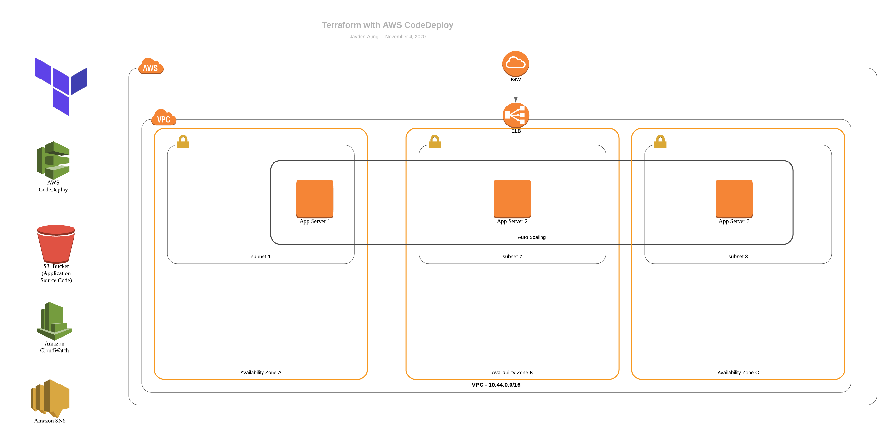
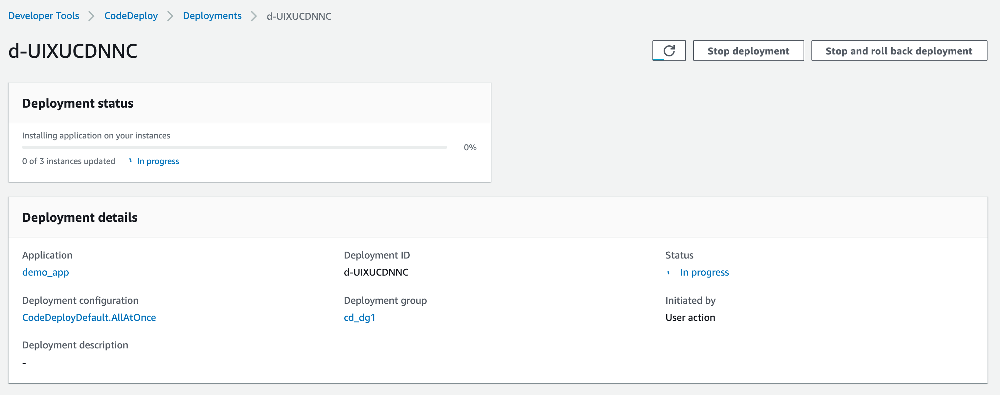
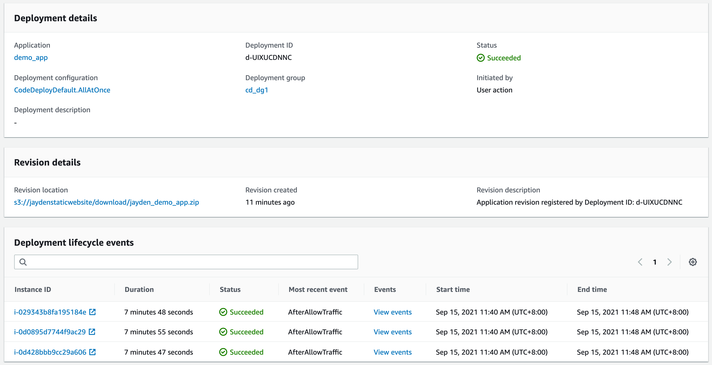

# AWS Code Deploy Terraform Lab

One important aspect of DevOps is automating the deployment of your apps, and release of new features. And it'll be great if you can use Infrastructure-as-Code (IaC) together with cloud provider-native deployment tools to orchestrate and automate the deployment process. In this lab, I'll show you how can use Terraform to automate creation of AWS infrastructure, and work with AWS CodeDeploy to automate deployment of a sample application. Again, this is ALL-AWS Lab, which means, besides Terraform, I'll be using only AWS services in the lab.




### What is AWS CodeDeploy?

AWS CodeDeploy is a fully managed deployment service that automates software deployments to a variety of compute services such as Amazon EC2, AWS Fargate, AWS Lambda, and your on-premises servers. AWS CodeDeploy makes it easier for you to rapidly release new features, helps you avoid downtime during application deployment, and handles the complexity of updating your applications.You can use AWS CodeDeploy to automate software deployments, eliminating the need for error-prone manual operations. The service scales to match your deployment needs. 
(source:AWS website)

## Prerequisites

1. [Install Terraform](https://learn.hashicorp.com/tutorials/terraform/install-cli)
2. [Install AWS CLI](https://docs.aws.amazon.com/cli/latest/userguide/cli-chap-install.html)

## What exactly we will be doing in this lab?

In this lab, I will show you how you can automate and orchestrate creating your AWS infrastructure by using Terraform as IaC, and deploying your application via AWS CodeDeploy. 

1. Download terraform scripts from this Git repo
2. Create ``` terraform.tfvars```
3. Create your AWS environment with Terraform 
4. Create CodeDeployment "Deployment" manually 

> Note: This lab focuses on automation capability of Terraform, and is designed to make you understand how CodeDeploy works. Hence, the manual process. This process can be automated using AWS CodePipeline. I'll add CodePipeline section at some point.
5. Test the application deployed by CodeDeploy
6. Clean up

---
## 1. Download terraform scripts from this Git repo

Download the necessary terraform scripts by simply cloning (e.g. ```git clone```) this Git repo into your local directory. These terraform scripts will create the following;

1. VPC in ap-southeast-1 Region (you can choose any region that you like)
2. 3 Subnets in 3 different availability zones
3. Route table
4. Launch configuration
5. Autoscaling group
6. 3 EC2 instances (application servers) with code deploy agents installed
7. An Application load balancer to load-balance the application servers
7. CodeDeploy Deployment Group
8. IAM roles for EC2 and Codedeploy
9. SNS topic for CodeDeploy
10. Route53 (optional)

> You might want to exclude/delete route53.tf if you don't have any route53 domain.

---
## 2. Create terraform.tfvars
---

We need values that correspond with the ones defined in ```variables.tf```. You will need to create terraform.tfvars for your own variables. For example, ARN of your AWS EC2 Full access role - which is specific to your AWS environment, and can be considered sensitive for public sharing as well. 

I didn't include mine in this repo for the obvious reasons, and that's why you will need to create one yourself, and place it in the same directory as the rest of terraform scripts. 

``` bash
touch terraform.tfvars

```

In the file, you will need create the following values that correspond with variables in the ```variables.tf``` file. Take note of required AWS-managed policy ARNs in your AWS accounts

For example, below is the **AmazonEC2FullAccess**. Take note of the ARN. We will need the IAM policies to be attached to the role that is used by CodeDeploy (This will be automatically done by Terraform). 


### terraform.tfvars

``` bash

AmazonEC2FullAccess_arn = "Your Value" 
AWSCodedeploy_arn = "Your Value"
AmazonS3FullAccess_arn = "Your Value"
key_name = "Your Value"
ubuntu_18_sydney = "Your Value"
r53zone = "Your Value"
externaldnshost = "Your Value"

```

You will need to ***carefully*** consider the followings for ```terraform.tfvars``` file:

* AmazonEC2FullAccess_arn - Update this with the ARN of AmazonEC2FullAccess policy in your AWS account. You already have a AWS-managed Policy in your AWS Account called "AmazonEC2FullAccess. 

* AWSCodedeploy_arn - Update this with the ARN of AWSCodedeployRole policy in your AWS account.

* AmazonS3FullAccess_arn: Update this with the ARN of AWSCodedeployRole policy in your AWS account. This may or may not be necessary. If your source code is on a private S3 bucket of your own, just create an IAM policy which allows access to that particular S3 bucket, and source code object (zip). 

* key_name: Update this with your EC2 SSH Keys

* ubuntu_18_sydney - Update this with AMI ID of Ubuntu AIM in your region"

* r53zone - Update this with your Route53 domain name (This is optional). You will need this Only if you have a Route53 domain. Otherwise, please skip this and delete "route53.tf"

* externaldnshost - You will need this If you have a Route53 domain, this is the A host for the domain. Otherwise, please skip this and delete "route53.tf".

> Note: Ec2 and S3 FullAccess policies SHOULD ONLY BE USED FOR DEMO ENVIRONMENT ONLY! You should always use granular policies in production environment. 

---
## 3. Create your AWS environment with Terraform

Finally, To execute the terraform script, just do the following:

```bash
	terraform init 
  terraform plan #(And check if the plan works out for you) 
  terraform apply #Enter "yes" to confirm
```
A CodeDeploy deployment group will be automatically created by Terraform. And you will just need to create a deployment and deploy your app manually as the final step.

> Note: This lab focuses on automation capability of Terraform, and is designed to make you understand how CodeDeploy works. Hence, the manual process. This process can be automated using AWS CodePipeline. I'll add CodePipeline section at some point.


### Expected Output

``` bash

Do you want to perform these actions?
  Terraform will perform the actions described above.
  Only 'yes' will be accepted to approve.

  Enter a value: yes

data.aws_availability_zones.azs: Reading... [id=2020-11-04 03:08:35.205101 +0000 UTC]
data.aws_availability_zones.azs: Read complete after 0s [id=2020-11-04 03:08:45.11834 +0000 UTC]
aws_autoscaling_group.devops_web_asg: Creating...
aws_autoscaling_group.devops_web_asg: Still creating... [10s elapsed]
aws_autoscaling_group.devops_web_asg: Still creating... [20s elapsed]
aws_autoscaling_group.devops_web_asg: Still creating... [30s elapsed]
aws_autoscaling_group.devops_web_asg: Still creating... [40s elapsed]
aws_autoscaling_group.devops_web_asg: Creation complete after 49s [id=devops_web_asg]
aws_autoscaling_policy.devops_web_asg_policy_up: Creating...
aws_autoscaling_policy.devops_web_asg_policy_down: Creating...
aws_codedeploy_deployment_group.cd_dg1: Creating...
aws_autoscaling_policy.devops_web_asg_policy_down: Creation complete after 0s [id=devops_web_asg_policy_down]
aws_autoscaling_policy.devops_web_asg_policy_up: Creation complete after 0s [id=devops_web_asg_policy_up]
aws_cloudwatch_metric_alarm.devops_web_asg_cpu_alarm_up: Creating...
aws_cloudwatch_metric_alarm.devops_web_asg_cpu_alarm_down: Creating...
aws_cloudwatch_metric_alarm.devops_web_asg_cpu_alarm_up: Creation complete after 0s [id=devops_web_asg_cpu_alarm_up]
aws_cloudwatch_metric_alarm.devops_web_asg_cpu_alarm_down: Creation complete after 0s [id=devops_web__asg_cpu_alarm_down]
aws_codedeploy_deployment_group.cd_dg1: Creation complete after 1s [id=5bd73cc7-247f-41b7-9235-5b1c2cbb6cba]

Apply complete! Resources: 6 added, 0 changed, 0 destroyed.

Outputs:

public_dns = devops-sg-ASG-EALB-123456.ap-southeast-1.elb.amazonaws.com
```

**Take Note of the public_dns** of the application load balancer (Output) which is devops-sg-ASG-EALB-123456.ap-southeast-1.elb.amazonaws.com in my example. You will need it to access the sample web application.

By now, the following resources have been created by Terraform.

1. VPC in ap-southeast-1 Region (you can choose any region that you like)
2. 3 Subnets in 3 different availability zones
3. Route table
4. Launch configuration
5. Autoscaling group
6. 3 EC2 instances (application servers) with code deploy agents installed
7. An Application load balancer to load-balance the application servers
7. CodeDeploy Deployment Group
8. IAM roles for EC2 and Codedeploy
9. SNS topic for CodeDeploy
10. Route53 (optional)

---
## 4. Create CodeDeployment "Deployment" manually  

Follow the step-by-step instructions to manually create a CodeDeploy deployment. 

### 1. Verify that CodeDeploy Application has been created
 Once the terraform script is completed, you should see that a sample application has been created in AWS CodeDeploy console called "demo_app" which is the name of my sample app. (You can use your own application for testing.)

 1. Go to AWS Console
 2. Go to "CodeDeploy", and "Applications"


### 2. Create Deployment

* Click on the "demo_app".
* Under "Deployment groups", you should see a deployment group called "cd_dg1" which has been created by Terraform. Click on it.
* In the deployment group page, You will see "Create deployment" button.
* Click on it.


You are now in "Create Deployment" settings.

* Make sure that "cd_dg1" is selected for Deployment group.
* Choose "My application is stored in Amazon S3"
* My sample demo_app is hosted on S3 ```s3://jaydenstaticwebsite/download/demo_cd.zip``` and it is publicly accessible. (That's why you may not need S3 policy for CodeDeploy.) You can use either my application source code or your own application source code.
* Choose "zip" for Revision File Type (This should be automatically chosen for you.)


* In "Deployment group overrides", Choose ```CodeDeployDefault.AllAtOnce``` for "Deployment configuration".

> Well, this is optional. For the test purpose, my terraform script has created a deployment configuration which will deploy the application to the servers ONE BY ONE - which takes more time. So if you want a shorter deployment, choose "AllAtOnce".

* Finally, Click "Create Deployment"


You should see the following status page that shows "installing application on your instances" status.

Observe that CodeDeploy is deploying application to all your EC2 instances at once! 



After a few minutes, you should see a message under the deployment status, saying "3 of 3 instances updated - Succeeded"!



---
## 5. Test the application deployed by CodeDeploy 

Now, you can go ahead and access the DNS name of the application load balancer on your browser, and you should see my demo sample web app. 

> Note: By now, the application code is deployed to all 3 ec2 instances, and an application load balancer which sits in front of application servers is exposed to the Internet for public access. 


CONGRATULATIONS! You've successfully automated creation of AWS infrastructure, and deployed your application to applications servers using Terraform & AWS CodeDeploy!

---
## 6. Clean-up

To clean up, simply execute the following command in the terraform directory, and enter "yes" when it asks for confirmation of deletion. 

```bash 
terraform destroy
```

This will delete everything that has been created by Terraform. 

---
Hope you've enjoyed this. Happy  Terraforming on AWS! 

Best, \
Jayden Aung


